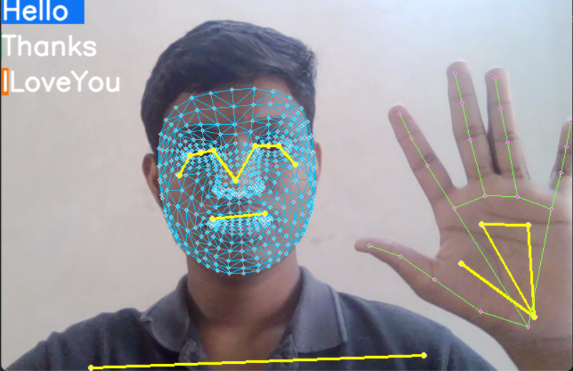
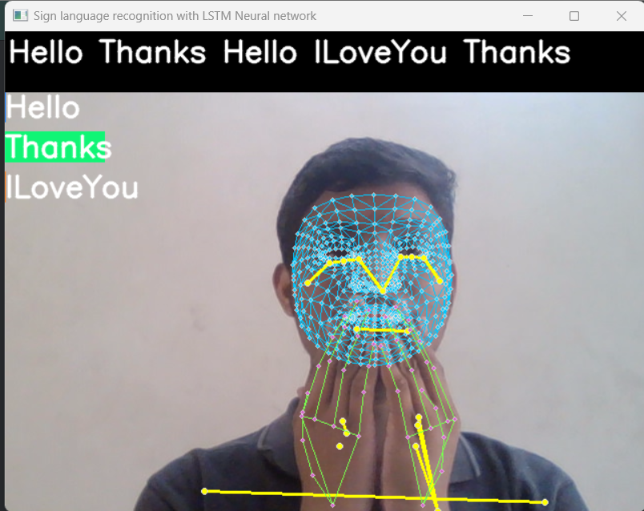

# Sign Language Recognition with LSTM Neural Network

## Introduction

Sign language is a comprehensive language system that employs hand gestures, facial expressions, and body movements to communicate. It serves as a primary means of communication for individuals who are deaf or hard of hearing.

In this project, we aim to bridge the communication gap by developing a system that can recognize and interpret sign language. We leverage the power of Long Short-Term Memory (LSTM) neural networks, a type of Recurrent Neural Network (RNN) well-suited for sequence prediction problems.

## Preview

 



## Technologies Used
- Python 3.8
- opencv-python~=4.9.0.80
- numpy~=1.26.4
- mediapipe~=0.10.9
- scikit-learn~=1.4.1.post1
- tensorflow~=2.15.0

## Usage

| To use the application, Python 3.8 must be installed on your machine.

1. Fork the repository


2. Clone the repository to your local machine
```bash
git clone https://www.github.com/<yourname>/Sign-Language-Recognition.git
```

3. Install the required packages using pip

```bash
pip install -r requirements.txt
```

4. Run the application
```bash
python main.py
```

## LICENSE
The project is licensed under the MIT License. See the [LICENSE](LICENSE) file for more details.